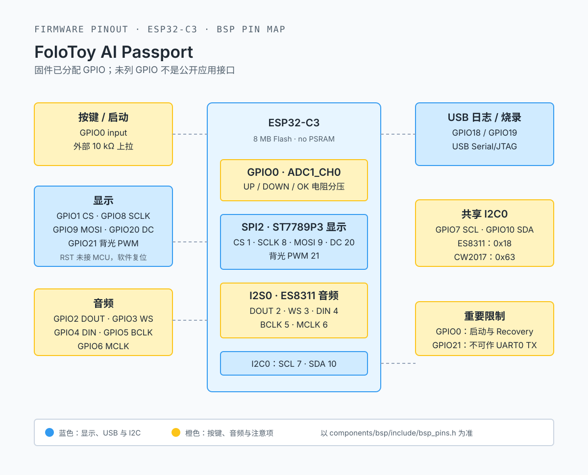

<p align="right">
  <a href="AGENTS.zh_CN.md">Simplified Chinese</a> · <strong>English</strong>
</p>

# AI Passport Firmware Repository Guide

This is the mandatory entry point for AI-assisted work. Read the directed
references for the task at hand instead of loading every README by default.

## Project Baseline

This repository builds, verifies, and flashes community firmware for the
FoloToy AI Passport. The target is an ESP32-C3 AI Passport card with display,
three buttons, audio, battery, Wi-Fi, BLE, and low-power board support.

The release artifact is the complete image recognized by the AI Passport
mini-program BLE installer:

```text
build/FoloToy-AI-Passport-full.bin
```

Do not treat the application-only `FoloToy-AI-Passport.bin` as the release or
default flashing artifact.

### Compatibility Contracts

- The target is ESP32-C3 with 8 MB Flash, no PSRAM, and ESP-IDF 5.5.3.
- The `factory` application partition begins at `0x10000` and is limited to
  `0x300000` bytes (3 MB).
- The `cardid` partition is fixed at `0x356000` with size `0x4000`. It can
  contain device identity and must not be modified, erased, packaged, or
  overwritten.
- The permanent Recovery image is fixed at `0x700000` with size `0x100000`.
  It must not be moved, replaced, or overwritten.
- Holding the UP key (GPIO0) for five seconds at boot must enter permanent
  Recovery.
- Devices with an existing identity should use mini-program BLE installation by
  default. Direct flashing from `0x0` is allowed only when the complete image
  ends before `cardid`.

Before editing, run `git status --short --branch`. Preserve user changes and
never clean or overwrite unrelated files, credentials, device QR secrets,
private keys, personal data, or unsanitized logs.

Maintained Markdown uses English at the default `.md` path and Simplified
Chinese in the paired `.zh_CN.md` file. Keep both versions aligned and retain
reciprocal language links.

## Code Boundaries

- `components/bsp/`: reusable board capabilities, including display, buttons,
  I2C, audio, and battery support.
- `main/`: menus, pages, state machines, animation, and application tasks.
- `components/bsp/include/bsp_pins.h` is the sole source of truth for hardware
  pins and parameters. Do not duplicate GPIO definitions, I2C addresses, or
  display dimensions in `.c` files.
- LVGL is not thread-safe. Code outside the LVGL task must hold
  `bsp_lvgl_lock()` before accessing LVGL objects.
- Button callbacks must stay non-blocking. Run audio, storage, and network work
  in worker tasks.
- Before deleting a demo screen, stop every task, timer, callback, and event
  handler that could still access its UI.
- Keep testable state machines, protocols, time logic, and layout calculation
  independent of ESP-IDF/LVGL and cover them with host tests.

Hardware facts follow this priority: product specification and measured results
> `bsp_pins.h` > BSP headers and implementation > hardware development guide >
demo/README. Do not guess hardware details not defined by these sources.

## Firmware Pinout



This is a firmware GPIO mapping, not a PCB component-placement or pad-number
diagram. Update `components/bsp/include/bsp_pins.h` before updating this image
when changing pin assignments.

## Hardware Specification

| Item | Specification |
| --- | --- |
| Form factor | Wearable AI Passport, transparent case, 60 x 95 x 8.5 mm, about 50 g |
| MCU | ESP32-C3, 8 MB Flash, no PSRAM |
| Display | ST7789P3, 240 x 320 TFT, RGB565, SPI2, 40 MHz, mode 0 |
| Wireless | 2.4 GHz Wi-Fi 802.11 b/g/n, Bluetooth 5 LE |
| NFC | Passive NTAG213 with ordinary NDEF read/write; no MCU BSP API |
| Buttons | UP/DOWN/OK through the GPIO0 / ADC1_CH0 resistor ladder |
| Audio | ES8311 codec, I2S0 full duplex, internal microphone and speaker |
| Battery | 520 mAh rechargeable Li-ion battery, CW2017 gauge |
| Charging and log | USB-C 2.0, 5 V input, ESP32-C3 USB Serial/JTAG on GPIO18/19 |

### Pins and Shared Resources

| Resource | Assignment |
| --- | --- |
| LCD | MOSI GPIO9, SCLK GPIO8, CS GPIO1, DC GPIO20, backlight PWM GPIO21; reset is not connected to the MCU |
| Buttons | GPIO0 / ADC1_CH0; UP/DOWN/OK ranges are `[0,150)`, `[150,447)`, and `[447,1900)` mV |
| I2C0 | SDA GPIO10, SCL GPIO7; ES8311 at `0x18`, CW2017 at `0x63` |
| I2S0 | MCLK GPIO6, BCLK GPIO5, WS GPIO3, DOUT GPIO2, DIN GPIO4 |
| USB console | GPIO18/19; do not use default UART0 TX because GPIO21 drives the backlight |

I2C0, I2S0, ADC1, SPI2, backlight LEDC, and internal RAM are controlled shared
resources. ESP32-C3 has no PSRAM, so do not casually enlarge LVGL or I2S DMA
buffers. GPIO0 also affects boot behavior; validate any reassignment on real
hardware.

## Build, Run, and Flash

### Environment

Use ESP-IDF 5.5.3:

```bash
source <ESP-IDF-v5.5.3-path>/export.sh
idf.py --version
```

The version must be `ESP-IDF v5.5.3`. Do not edit `managed_components/`;
dependency versions are locked in `dependencies.lock`.

### Build and Deliver

All builds and flashing enter through the root `Makefile`. Build the production
firmware and verify its protected layout with:

```bash
make build-device
```

The only release artifact is:

```text
build/FoloToy-AI-Passport-full.bin
```

For QEMU and incremental device work:

```bash
make build-qemu
make run-qemu
make flash-device PORT=/dev/cu.usbmodem1101
```

Before delivery, follow the final production firmware build with
`make run-qemu`. Do not treat a release candidate as validated until QEMU has
flashed the image to its virtual 8 MB Flash and the firmware has booted
successfully.

`make flash-device` uses segmented flashing. A complete write from `0x0`
requires `make flash-device-full PORT=... FULL_FLASH=1` after confirming the
device is safe. `idf.py fullclean` removes only generated output; confirm it
does not affect a deliberately retained local `sdkconfig`.

### Flashing Rules

1. Use a USB-C cable that supports data and close other serial monitors or
   WebSerial pages.
2. Flash the verified `build/FoloToy-AI-Passport-full.bin` to new devices or
   devices confirmed safe for a complete write.
3. For a device with `cardid` identity, prefer mini-program BLE installation or
   segmented application flashing. Do not write from `0x0` unless the image has
   been verified not to reach `0x356000` or later.
4. Confirm startup with the USB Serial/JTAG log and confirm UP held for five
   seconds still enters Recovery.
5. A successful build is not hardware validation. Verify display, buttons,
   audio, battery, and wireless changes separately on a physical device.

## Testing and Delivery

Use the smallest relevant check while iterating. Before delivery, run:

```bash
make test
make build-device
make check
make run-qemu
```

- `test`: repository consistency, workflows, documentation links, sensitive
  content checks, and host tests.
- `build-device`: production ESP-IDF build, merged image, and AI Passport BLE
  compatibility checks.
- `check`: both gates in sequence.
- `run-qemu`: mandatory after the final release-candidate build; flashes the
  isolated QEMU image to virtual Flash and starts it for boot validation.

The complete gate requires ESP-IDF 5.5.3. Do not describe a successful build as
hardware verification. Report the following independently:

```text
Build: PASS / FAIL / NOT RUN
Host tests: PASS / FAIL / NOT RUN
Device tests: PASS / FAIL / NOT RUN
Unverified: remaining user, board, or instrument checks
```

Create commits, push, or release only when requested or required by the active
workflow. Record user-visible behavior in `docs/CHANGELOG.md`; internal
refactors, CI maintenance, typo fixes, and generated output normally need no
changelog entry.

## Directed References

| Task | Read before editing |
| --- | --- |
| Any code change | `docs/development/ai-guide.md`, relevant headers, and adjacent implementation |
| Environment bootstrap or missing toolchain | `docs/development/engineering/environment-setup.md` |
| BSP, pins, buses, display, audio, battery | `docs/hardware-design/AI_HARDWARE_DEVELOPMENT_GUIDE.md`, `components/bsp/include/bsp_pins.h` |
| Build, test, partitions, flashing | `docs/development/engineering/build-and-test.md`, `docs/development/engineering/ble-recovery-compatibility.md`, `sdkconfig.defaults`, `partitions.csv` |
| Menu and demos | `main/demo.h`, `main/main.c`, adjacent `main/demo_*.c` |
| CI or release | `docs/development/ci/CI-*.md` and `.github/workflows/` |
| Project completion | `docs/development/release/project-completion.md` |
| Documentation | `docs/contribution/doc-conventions.md` |
| Commit and PR | `docs/contribution/commit-and-pr.md` |

Use `docs/README.md` for the product overview and documentation index. Use
`docs/development/ai-guide.md` for detailed AI development rules. Fork-specific
guidance is in `docs/fork-guide.md`.
